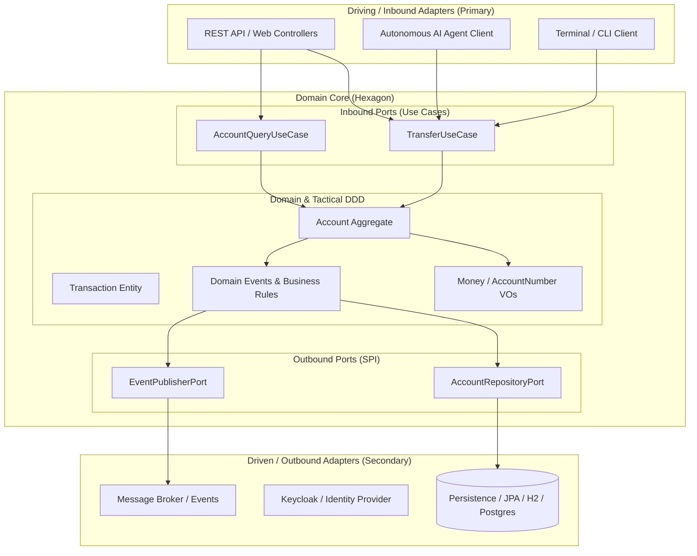

# 🏛️ Atlas Bank — From Monolithic CRUD to Hexagonal Architecture

[](https://openjdk.org/)
[](https://spring.io/projects/spring-boot)
[]()
[](https://www.keycloak.org/)
[]()

> **"It's not about learning how to make endpoints; it's about learning how to design software with the mindset of a software architect."**

---

## 📌 Project Overview

**Atlas Bank** is a backend banking system that begins as a simple CRUD monolith built with Spring Boot and progressively evolves into a **robust, decoupled, testable, and maintainable professional architecture**.

The system is developed with a fundamental engineering philosophy: **the pain appears first in the code, followed by the architectural solution**. Every pattern, boundary, and technical decision is justified by solving concrete software design bottlenecks.



---

## 🚀 Architectural Pillars & Core Learnings

### 1. SOLID Principles & GoF Design Patterns
- **S.O.L.I.D. principles** applied to real coupling and scalability challenges.
- Behavioral and Creational patterns: **Strategy Pattern** (dynamic fee computation by account type using polymorphic Spring collections), **Factory**, **Observer**, and more.

### 2. Tactical Domain-Driven Design (DDD)
- Expressive domain modeling decoupled from persistence and framework mechanics.
- Implementation of rich **Entities**, immutable **Value Objects**, **Aggregates**, and **Domain Events**.

### 3. Hexagonal Architecture (Ports & Adapters)
- Strict inversion of dependencies: business rules never depend on infrastructure or third-party libraries.
- Step-by-step refactoring journey from a traditional layered MVC architecture to Hexagonal Ports & Adapters.

### 4. Enterprise-Grade Security with Keycloak & OAuth2
- Industry-standard identity and access management using **OAuth2**, **OpenID Connect (OIDC)**, and **JWT** (JSON Web Tokens).
- Decoupled authentication server orchestrated via containers.

### 5. Lightweight CQRS & Architectural Fitness Functions (ArchUnit)
- Clear segregation of write models (commands) and read models (queries).
- **ArchUnit integration**: Automated architectural unit tests ensuring package boundaries, layer separation, and dependency constraints are continuously verified in CI/CD pipelines.

### 6. AI Agent as a First-Class System Client
- Integration of an **autonomous AI agent** consuming the banking system via *Tool Use* / *Function Calling* and *OpenCode*.
- **The Ultimate Architecture Validation**: Demonstrating that whether the consumer is a REST client, a CLI, or an autonomous AI agent, it can operate against the core domain use cases without breaking invariants.

---

## 🛠️ Technology Stack

| Component | Technology |
| :--- | :--- |
| **Language** | Java 21 LTS |
| **Framework** | Spring Boot 3.x / 4.x |
| **Persistence** | Spring Data JPA / Hibernate |
| **Database** | In-Memory H2 (Dev/Testing) & PostgreSQL (Production) |
| **Security** | Spring Security & Keycloak (OAuth2 / JWT) |
| **Architecture Testing** | ArchUnit |
| **Unit & Integration Testing** | JUnit 5, Mockito, AssertJ |
| **Containerization** | Docker & Docker Compose |
| **Build Tool** | Maven Wrapper (`./mvnw`) |

---

## 📦 Evolutionary Project Structure

```text
src/main/java/com/atlas/bank/atlas_bank/
├── domain/                  # Pure business core (Zero dependencies on Spring / JPA)
│   ├── model/               # Aggregates, Entities, Value Objects
│   └── port/                # Inbound (Use Cases) and Outbound (SPI) Ports
├── application/             # Application orchestration & business workflows
│   └── service/             # Use case implementations & domain policy coordination
├── infrastructure/          # Technical infrastructure & technical adapters
│   ├── adapter/
│   │   ├── in/              # Inbound adapters (REST Controllers, CLI, AI tools)
│   │   └── out/             # Outbound adapters (JPA Repositories, Database Entities)
│   └── config/              # Spring configuration beans, Security, Framework wiring
```

---

## ⚡ Getting Started / Local Setup

### Prerequisites
* **Java 21 LTS** or higher installed.
* **Docker Desktop** (recommended for Keycloak and database containers).

### Build & Run
1. Clone this repository:
   ```bash
   git clone https://github.com/YOUR_USERNAME/springboot-hexagonal-demo.git
   cd springboot-hexagonal-demo
   ```

2. Compile with Maven Wrapper:
   ```bash
   ./mvnw clean compile
   ```

3. Launch the application:
   ```bash
   ./mvnw spring-boot:run
   ```

4. Access the embedded in-memory database console (H2):
   * URL: `http://localhost:8080/h2-console`
   * **JDBC URL:** `jdbc:h2:mem:atlasbank`
   * **User Name:** `sa`
   * **Password:** *(leave blank)*

---

## 🧪 Running Tests

To run the complete test suite, including architectural verification tests with ArchUnit:

```bash
./mvnw test
```

---

## 🎯 Engineering Philosophy

> *"By completing this project, you don't just build another banking API for your portfolio; you develop the **technical judgment** needed to decide when to apply an architecture, when not to, and how to defend design decisions with solid software engineering foundations."*
