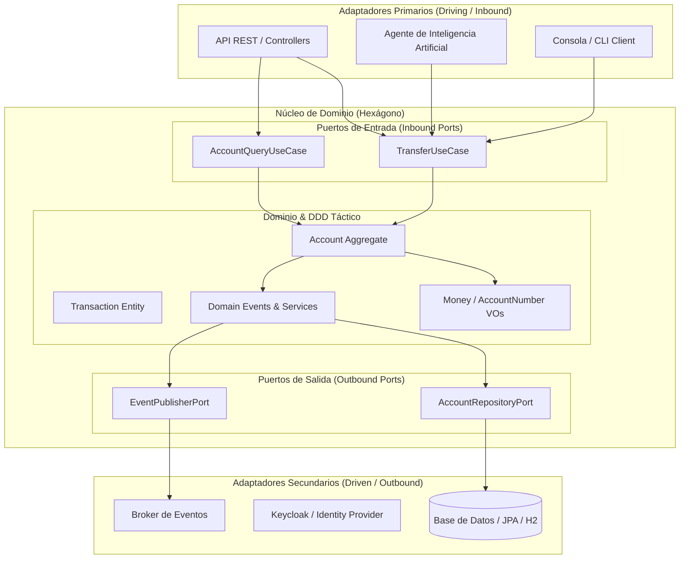

# 🏛️ Atlas Bank — De CRUD Monolítico a Arquitectura Hexagonal

[](https://openjdk.org/)
[](https://spring.io/projects/spring-boot)
[]()
[](https://www.keycloak.org/)
[]()

> **"No se trata de aprender a hacer endpoints, sino de aprender a diseñar software pensando como un arquitecto."**

---

## 📌 Visión del Proyecto

**Atlas Bank** es un sistema bancario backend que comienza como un monolito simple (CRUD con Spring Boot) y evoluciona progresivamente hacia una **arquitectura desacoplada, testeable y mantenible**.

El desarrollo sigue una premisa fundamental: **primero aparece el dolor en el código, después la solución arquitectónica**. A través de problemas reales de escalabilidad y acoplamiento, se justifica e implementa cada patrón y decisión de diseño.



---

## 🚀 Pilares de Aprendizaje y Arquitectura

### 1. Principios SOLID y Patrones de Diseño GoF
- **S.O.L.I.D.** aplicados con problemas prácticos de acoplamiento.
- Patrones de comportamiento y creación: **Strategy** (cálculo dinámico de comisiones por tipo de cuenta), **Factory**, **Observer**, entre otros.

### 2. Domain-Driven Design (DDD Táctico)
- Modelado de un dominio bancario expresivo y libre de dependencias de infraestructura.
- Implementación de **Entities**, **Value Objects** inmutables, **Aggregates** y **Domain Events**.

### 3. Arquitectura Hexagonal (Ports & Adapters)
- Separación estricta entre la lógica de negocio y los detalles técnicos (bases de datos, frameworks, protocolos de red).
- Migración paso a paso desde una arquitectura en capas tradicional hacia puertos y adaptadores.

### 4. Seguridad Empresarial con Keycloak & OAuth2
- Autenticación y autorización basada en estándares del sector (**OAuth2**, **OpenID Connect** y tokens **JWT**).
- Servidor de identidad desacoplado gestionado con contenedores.

### 5. CQRS Liviano & Testing Arquitectónico
- Separación de responsabilidades entre flujos de comando (escritura) y consulta (lectura).
- **ArchUnit**: Tests automatizados en el pipeline de CI/CD que validan y garantizan que las reglas de arquitectura y las fronteras de paquetes no se rompan con el tiempo.

### 6. Agente de IA como Cliente de la Arquitectura
- Conexión de un **agente inteligente** como cliente de la aplicación (mediante *Tool Use* y *OpenCode*).
- **Validación del desacoplamiento**: demuestra que cualquier consumidor (REST, CLI o un agente de IA autónomo) puede interactuar con el sistema a través de los mismos casos de uso sin violar las reglas de dominio.

---

## 🛠️ Stack Tecnológico

| Componente | Tecnología |
| :--- | :--- |
| **Lenguaje** | Java 21 LTS |
| **Framework** | Spring Boot 3.x / 4.x |
| **Persistencia** | Spring Data JPA / Hibernate |
| **Base de Datos** | H2 (desarrollo/test) & PostgreSQL |
| **Seguridad** | Spring Security & Keycloak (OAuth2 / JWT) |
| **Testing** | JUnit 5, Mockito, AssertJ, ArchUnit |
| **Contenedores** | Docker & Docker Compose |
| **Herramienta de Construcción** | Maven Wrapper (`./mvnw`) |

---

## 📦 Estructura del Proyecto (Evolutiva)

```text
src/main/java/com/atlas/bank/atlas_bank/
├── domain/                  # Núcleo de negocio puro (independiente de Spring/JPA)
│   ├── model/               # Entidades, Value Objects, Agregados
│   └── port/                # Interfaces de entrada (Use Cases) y salida (SPI)
├── application/             # Servicios de aplicación y orquestación
│   └── service/             # Implementaciones de casos de uso y cálculo de comisiones
├── infrastructure/          # Detalles técnicos y adaptadores
│   ├── adapter/
│   │   ├── in/              # Adaptadores de entrada (REST Controllers)
│   │   └── out/             # Adaptadores de salida (JPA Repositories, DB Entities)
│   └── config/              # Seguridad, beans y configuración del framework
```

---

## ⚡ Comenzar / Ejecución Local

### Prerrequisitos
* **Java 21** o superior instalado.
* **Docker Desktop** (opcional para Keycloak y servicios auxiliares).

### Compilar y Ejecutar
1. Clonar el repositorio:
   ```bash
   git clone https://github.com/TU_USUARIO/springboot-hexagonal-demo.git
   cd springboot-hexagonal-demo
   ```

2. Compilar con el wrapper de Maven:
   ```bash
   ./mvnw clean compile
   ```

3. Ejecutar la aplicación:
   ```bash
   ./mvnw spring-boot:run
   ```

4. Acceso a la consola de base de datos en memoria (H2):
   * URL: `http://localhost:8080/h2-console`
   * **JDBC URL:** `jdbc:h2:mem:atlasbank`
   * **User Name:** `sa`
   * **Password:** *(en blanco)*

---

## 🧪 Ejecutar Tests

Para correr toda la suite de pruebas unitarias y de arquitectura (ArchUnit):

```bash
./mvnw test
```

---

## 🎯 Objetivo y Filosofía

> *"Al terminar este proyecto no solo tendrás una API bancaria funcional y un proyecto sólido para tu portfolio; tendrás **criterio técnico** para saber cuándo aplicar una arquitectura, cuándo no, y cómo defender tus decisiones como arquitecto de software."*
